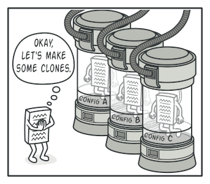

# nodejs-design-patterns

Design patterns encourage programming efficiency and code reuse.

## Anti-patterns

* Modifying the prototype on an instance
```js
person.__proto__.address = {}
```
* Syncing execution after initialization
```js
listen() {
    fs.readFileSync(...)
}
```
* Callback hell
```js
readFile(..., () => {
    parseDate(..., () => {
        writeFile(..., () => {
            logResponse(..., () => {}
        }
    }
}
```

## Design patterns

Reusable solution to a commonly occurring problem within a given context in software design.

### Creational Patterns

* Singleton pattern

    > "Ensure a class only has one instance, and provide a global point of access to it."

    

    All Singleton implementations have these two steps in common:

    * Make the default constructor private, to prevent other objects from using the new operator with the singleton class.
    * Create a static creation method that acts as a constructor. This method calls the private constructor under the hood to create an object and saves it to a static field. All subsequent calls to this method return the cached object.

    If your code has access to the singleton class, then it will be able to call the singleton's static method. So whenever that method is called, the same object is returned.

    Ex:
    * Created Singleton class to Logger -> [Normal Pattern](singleton-pattern)
    * Removed Singleton class to Logger because NodeJS `require` always put in the cache and use the same instance -> [NodeJS Pattern](singleton-nodejs-pattern)

* Prototype pattern

    > "Specify the kinds of objects to create using prototypical instance, and create new objects by copying this prototype."

    

    The Prototype pattern delegates the cloning process to the actual objects that are being cloned. The pattern declares a common interface for all objects that support cloning. This interface lets you clone an object without coupling your code to the class of that object. Usually, such an interface contains just a single `clone` method.

    Ex: Created scout_prototype -> [Pattern](prototype-pattern)

* Factory pattern

    > "Define an interface for creating an object, but let subclasses decide which class to instantiate. Factory Method lets a class defer instantiation to subclasses."

    

    The Factory Method pattern suggests that you replace direct object construction calls (using the `new` operator) with calls to a special factory method.

    Ex: Created userFactory -> [Pattern](factory-pattern)

* Builder pattern

    > "Separate the construction of a complex object from its representation so that the same construction process can create different representations. Used to resolve anti-pattern named a telescoping constructor (many params on the constructor)"

    

    The Builder pattern suggests that you extract the object construction code out of its own class and move it to separate objects called `builders`.

    Ex: Created PersonBuilder -> [Pattern](builder-pattern)

### Structural Patterns

* Adapter pattern

    > "Convert the interface of a class into anoter clients expect. Adapter lets classes work together that could't otherwise because of incompatible interfaces."

    

    You can create an adapter. This is a special object that converts the interface of one object so that another object can understand it.

    An adapter wraps one of the objects to hide the complexity of conversion happening behind the scenes. The wrapped object isn’t even aware of the adapter. For example, you can wrap an object that operates in meters and kilometers with an adapter that converts all of the data to imperial units such as feet and miles.

    Adapters can not only convert data into various formats but can also help objects with different interfaces collaborate. Here’s how it works:

    1. The adapter gets an interface, compatible with one of the existing objects.
    2. Using this interface, the existing object can safely call the adapter’s methods.
    3. Upon receiving a call, the adapter passes the request to the second object, but in a format and order that the second object expects.

    Sometimes it’s even possible to create a two-way adapter that can convert the calls in both directions.

    Ex: Created localStorare to work with Browser and NodeJS server -> [Pattern](adapter-pattern)

* Proxy pattern

    > "Provide a surrogate or placeholder for another object to control access to it."

    

    The Proxy pattern suggests that you create a new proxy class with the same interface as an original service object. Then you update your app so that it passes the proxy object to all of the original object’s clients. Upon receiving a request from a client, the proxy creates a real service object and delegates all the work to it.

    Ex: Created FS_Proxy to control `fs module` -> [Pattern](proxy-pattern)

* Composite pattern

    > "Compose objects into tree structure to represent part-whole hierarchies. Composite lets clients treat individual objects and compositions of objects uniformly."

    

    The greatest benefit of this approach is that you don’t need to care about the concrete classes of objects that compose the tree. You don’t need to know whether an object is a simple product or a sophisticated box. You can treat them all the same via the common interface. When you call a method, the objects themselves pass the request down the tree.

    Ex: Created CatalogGroup with the same interface -> [Pattern](composite-pattern)

* Decorator pattern

    **Also known as: `Wrapper`**

    > "Attach additional responsibilities to an object dynamically. Decorators provide a flexible alternative to subclassing for extending functionality."

    

    Extending a class is the first thing that comes to mind when you need to alter an object’s behavior. However, inheritance has several serious caveats that you need to be aware of.

    * Inheritance is static. You can’t alter the behavior of an existing object at runtime. You can only replace the whole object with another one that’s created from a different subclass.
    * Subclasses can have just one parent class. In most languages, inheritance doesn’t let a class inherit behaviors of multiple classes at the same time.

    Ex: Created Golden and Diamond Inventory -> [Pattern](decorator-pattern)

### Behavioral Pattherns

* Chain of responsability

    > "Avoid coupling the sender of a request to its receiver by giving more than one object a change to handle the request. Chain the receiving objects and pass the request along the chain."

    

    Like many other behavioral design patterns, the Chain of Responsibility relies on transforming particular behaviors into stand-alone objects called handlers. The pattern suggests that you link these handlers into a chain. Each linked handler has a field for storing a reference to the next handler in the chain. In addition to processing a request, handlers pass the request further along the chain. The request travels along the chain until all handlers have had a chance to process it.

    Ex: Created `Storage` to search in all Stores -> [Pattern](chain-of-reponsibility-pattern)

* Command pattern

    > " Encapsulate a request as an object, thereby letting you parameterize with different requests, queue or log request, and support undoable operations."

    

    Command is a behavioral design pattern that turns a request into a stand-alone object that contains all information about the request. This transformation lets you pass requests as a method arguments, delay or queue a request’s execution, and support undoable operations.

    * Use the Command pattern when you want to parametrize objects with operations.
    * Use the Command pattern when you want to queue operations, schedule their execution, or execute them remotely.
    * Use the Command pattern when you want to implement reversible operations.

    Ex: Created `commands` and your `conductor` -> [Pattern](command-pattern)

* Interator pattern

    > "Provide a way to access the elements of an aggregate object sequentially without exposing its underlying representation."

    Iterator is a behavioral design pattern that lets you traverse elements of a collection without exposing its underlying representation (list, stack, tree, etc.).

    The main idea of the Iterator pattern is to extract the traversal behavior of a collection into a separate object called an `iterator`.

    

    Ex: Created `Interator` class -> [Pattern](interator-pattern)

* Observer pattern

    > ""

    

    Ex: [Pattern](observer-pattern)

* Strategy pattern

    > ""

    

    Ex: [Pattern](strategy-pattern)
